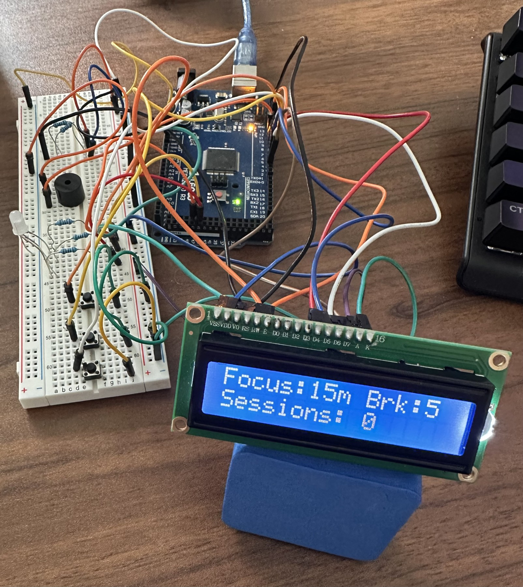

# Arduino Pomodoro Timer

A work-in-progress desktop focus timer built with an Arduino, a 16x2 LCD, push buttons, a buzzer, and an RGB LED.

The photo shows the breadboard prototype. Its LCD displays a session counter that is not present in the uploaded sketch, so the photographed firmware appears to be a different revision.

## Project status

- Timer operation verified on a breadboard prototype by the project author.
- Circuit schematic, PCB layout, and KiCad project files are included in this repository.
- Soldering components onto an Arduino protoshield is in progress.
- A fabricated custom PCB and completed protoshield have not yet been validated.

## My contributions

I assembled and tested the breadboard prototype, created the schematic and PCB layout in KiCad, and am working on protoshield assembly. The Arduino code was generated with AI assistance. This repository preserves the original sketch as a project snapshot.

## Features in the sketch

- Focus/break presets: 25/5, 15/5, and 50/10 minutes.
- Start, pause, resume, and reset controls.
- Mode selection while idle.
- Countdown on a 16x2 LCD.
- Red LED indication during focus and green during breaks.
- Audible feedback for timer events.

## Hardware

Arduino board, 16x2 LCD, three push buttons, buzzer, RGB LED, potentiometer, resistors, breadboard, and wiring. Protoshield assembly is underway.

The sketch uses digital pins 44, 45, and 46, which are available on a Mega 2560-class board. Confirm the actual board before uploading; the current pin assignment does not fit an Uno without changes. Exact component models and resistor values are not yet documented.

### Pin assignments from the sketch

| Function | Arduino pin |
| --- | --- |
| LCD RS | 12 |
| LCD enable | 11 |
| LCD D4, D5, D6, D7 | 5, 4, 3, 2 |
| Start / pause | 6 |
| Reset | 7 |
| Mode | 8 |
| Buzzer | 9 |
| RGB red | 44 |
| RGB blue | 45 |
| RGB green | 46 |

Buttons use `INPUT_PULLUP` and are active-low. This table documents the software pin assignment, not a complete wiring guide. Check LCD power/contrast wiring, RGB LED type, and current-limiting resistors against the hardware design.

## Open the sketch

1. Open `timer.ino` in the Arduino IDE. If prompted, allow the IDE to place it in a folder named `timer`.
2. Make the `LiquidCrystal` library available in the IDE.
3. Select the connected board and port, checking that its pins match the table above.
4. Verify/compile, then upload to the board.

## Validation and remaining work

The author reports successful breadboard operation. No new compile or physical hardware test was performed while preparing this repository.

- Complete protoshield soldering and retest all controls.
- Add the custom footprint library.
- Document component values and the exact board model.
- Test every preset, pause/resume in both phases, reset, and full focus-to-break transitions.
- Review a reset edge case: the sketch does not restore `wasFocusBeforePause` when resetting during a break. Resetting in a break, starting a new focus session, and then pausing/resuming may incorrectly resume in break mode. The original code is retained unchanged for now.

## KiCad files

Open `Timer.kicad_pro` for the main project, with `Timer.kicad_sch` and `Timer.kicad_pcb`. The additional `focus_timer_schematic.kicad_sch` file is preserved from the source folder; it appears to contain the Arduino header connections rather than the full timer circuit.

The footprint table references `Arduino_MountingHole.pretty`, which was not present in the supplied folder. The PCB contains placed footprint geometry, but updating the custom mounting-hole footprint from its library requires that missing library. PCB routing and electrical/design-rule checks have not been verified for this upload; treat the layout as work in progress, not fabrication-ready.
